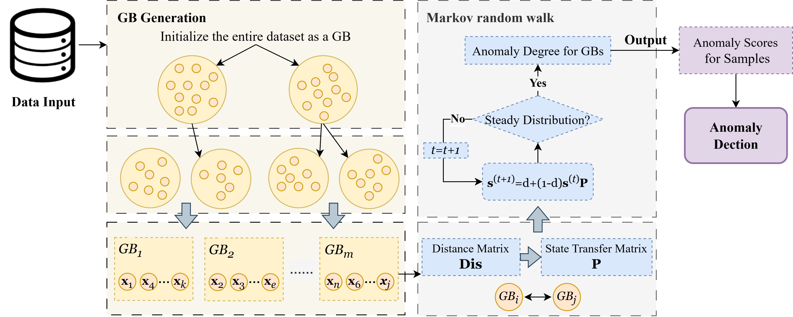

# GBRAD
Sihan Wang, **Zhong Yuan***, Shitong Cheng, Hongmei Chen, and Dezhong Peng, [Granular-ball computing-based Random Walk for anomaly detection](Paper/2025-GBRAD.pdf), Pattern Recognition, 165: 111588. (Code)

## Abstract
Anomaly detection is a key task in data mining, which has been successfully employed in many practical scenarios. However, most existing methods usually analyze the anomalous characteristics of samples at a 
single and finest granularity, which leads to high computational cost and low efficiency. As one of the significant mathematical models in the theory of granular computing, granular-ball computing can portray the 
distributional characteristics of data from a multi-granularity perspective. For this reason, this paper proposes an unsupervised anomaly detection method based on granular-ball computing. Firstly, the samples are covered 
by generating adaptive granular-balls, and the multi-granularity information represented by granular-balls with different sizes can reflect the data distribution characteristics of the corresponding region. Secondly, the 
granular-balls are used to fit the samples for constructing a state transfer matrix in Random walk. Then, the steady-state distribution is generated using iterative computation and is normalized as the degree of anomaly 
for each granular-ball. Finally, the anomaly score for each sample is computed by relating the anomaly degree of each granular-ball to the samples it covers. Comparative experiments show that the proposed anomaly 
detection method performs well on multiple datasets, demonstrating its feasibility and superiority in practical applications.

## Framework


## Usage
You can run GBRAD.py:
```
if __name__ == '__main__':
    L = 8  # Set the minimum number of samples L in the grain ball
    d = 0.35  # Set the damping factor for Markov random walk.

    data_name = 'iris_Irisvirginica_11_variant1'
    Exmaple = io.loadmat(r"datasets\\" + data_name)
    data = Exmaple['trandata'][:, :-1]  # data
    target = Exmaple['trandata'][:, -1]  # label

    samples_scores = GBRAD(data, L, d)
    print(samples_scores)
```
You can get outputs as follows:
```
out_scores =
   [0.8414522965922538, 0.8215772996541814, 0.8212994452743472, 0.8212994452743472, 0.8414522965922538, 0.9448146761615156, 0.8497201143510823, 0.8302865011080012, 0.8447433479928064, 0.8213002282806524, 0.8714455992113381, 0.8302865011080012, 0.8213002282806524, 0.8447433479928064, 0.9448146761615156, 0.9448146761615156, 0.9448146761615156, 0.8414522965922538, 0.9448146761615156, 0.8714455992113381, 0.8516102294983874, 0.8714455992113381, 0.8497201143510823, 0.8211580686768085, 0.8302865011080012, 0.8215772996541814, 0.8211580686768085, 0.8414522965922538, 0.8516102294983874, 0.8212994452743472, 0.8215772996541814, 0.8516102294983874, 0.9448146761615156, 0.9448146761615156, 0.8213002282806524, 0.8302865011080012, 0.8516102294983874, 0.8213002282806524, 0.8447433479928064, 0.8302865011080012, 0.8414522965922538, 0.8726621587737212, 0.8447433479928064, 0.8414522965922538, 0.8714455992113381, 0.8215772996541814, 0.8714455992113381, 0.8212994452743472, 0.8714455992113381, 0.8302865011080012, 0.9628318845722701, 0.9759490060215679, 0.9628318845722701, 0.9439887635266376, 0.9538157832706633, 0.9534904004237795, 0.9759490060215679, 0.9324596621627721, 0.9538157832706633, 0.9439887635266376, 0.9324596621627721, 0.9375828266570746, 0.9650190435890612, 0.9375828266570746, 0.9534904004237795, 0.9538157832706633, 0.9534939000022608, 0.9362775485702761, 0.940446560315094, 0.9650190435890612, 0.9759490060215679, 0.9479863059318013, 0.940446560315094, 0.9479863059318013, 0.9479863059318013, 0.9538157832706633, 0.9538157832706633, 0.9628318845722701, 0.9375828266570746, 0.9650190435890612, 0.9650190435890612, 0.9650190435890612, 0.9362775485702761, 0.940446560315094, 0.9534939000022608, 0.9759490060215679, 0.9628318845722701, 0.940446560315094, 0.9534904004237795, 0.9439887635266376, 0.9362775485702761, 0.9375828266570746, 0.9362775485702761, 0.9324596621627721, 0.9362775485702761, 0.9534904004237795, 0.9534904004237795, 0.9479863059318013, 0.9324596621627721, 0.9534904004237795, 1.0254724098045584, 1.0257886397494076, 1.0257886397494076, 0.9577653966538024, 1.0254724098045584, 1.0257886397494076, 1.0257886397494076, 1.0257886397494076, 1.0254724098045584, 1.0254724098045584, 1.0254724098045584]
```

## Citation
If you find GBRAD useful in your research, please consider citing:
```
@article{wang2025granular,
  title={Granular-ball computing-based Random Walk for anomaly detection},
  author={Wang, Sihan and Yuan, Zhong and Cheng, Shitong and Chen, Hongmei and Peng, Dezhong},
  journal={Pattern Recognition},
  pages={111588},
  year={2025},
  publisher={Elsevier}
}
```
## Contact
If you have any questions, please contact wangsihan0713@foxmail.com or yuanzhong@scu.edu.cn.

